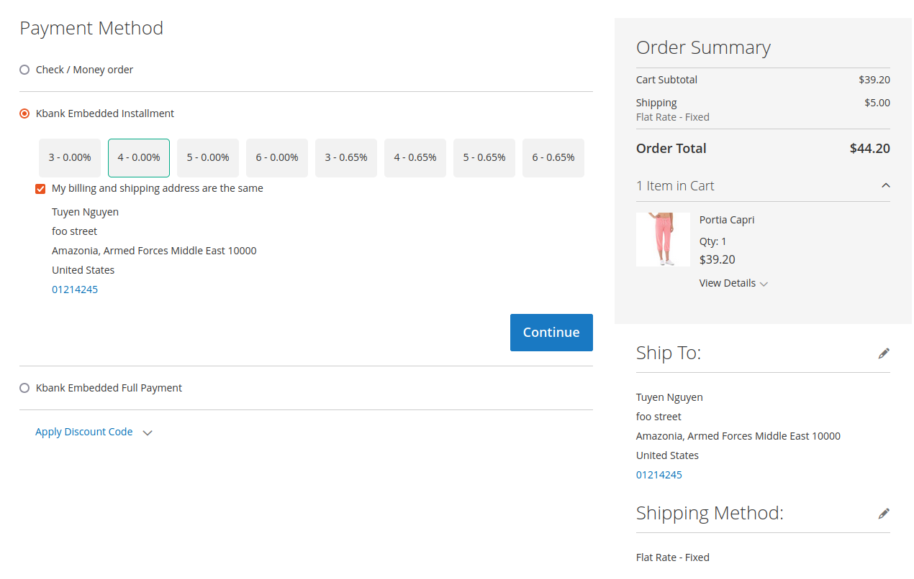
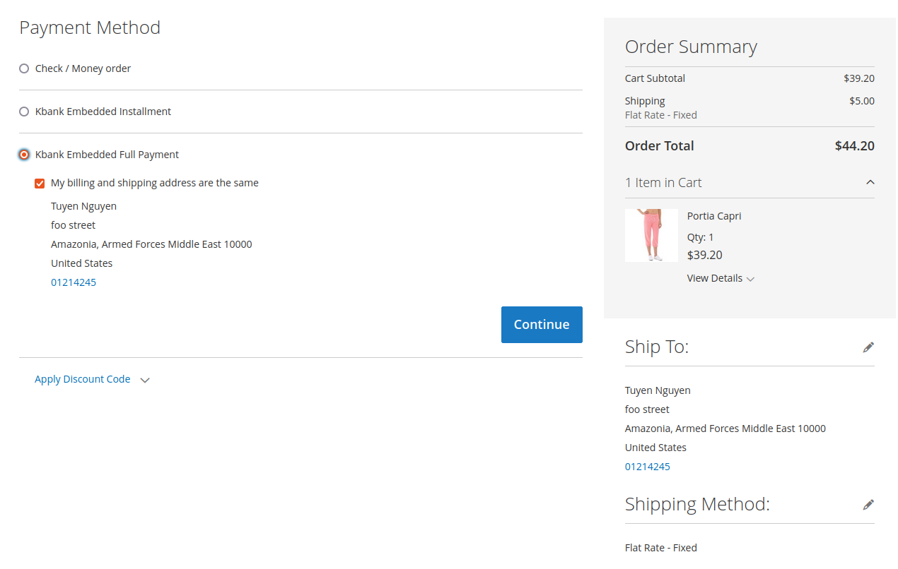
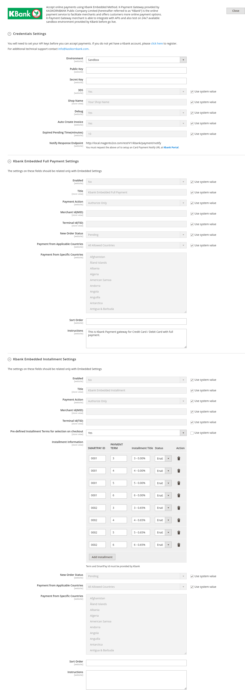

# Kasikornbank(Kbank) Magento 2 Payments Gateway Module #

    composer require ghoster/module-kbankpayments

---

## Features

* Module to add payment method Kbank (Kasikornbank) for Embedded UI Method
* Support 3DS
* Support Installment

## Compatibility 

| Magento Version (Open Source/Commerce) | Supported |
| -------------------------------------- | --------- |
| **2.0.x**                              | No ❌      |
| **2.1.x**                              | No ❌      |
| **2.2.x**                              | No ❌      |
| **<2.3.2**                             | No ❌      |
| **<2.3.5**                             | No ❌      |
| **>=2.3.5**                            | No ❌      |
| **2.4.0**                              | Yes ✔️     |
| **>=2.4.1 && < 2.4.6**                 | Yes ✔️     |
| **>=2.4.6**                            | Yes ✔️     |

## Configurations
* Require the public and secret key from the Gateway:
* `<base_url>/kbank/payment/callback` for Card Payment Callback URL: (Embedded Method only)
* `<base_url>/rest/V1/kbank/payment/notify` for Card Payment Notify URL: (Embedded Method only)

## Donation

If this project help you reduce time to develop, you can give me a cup of beer :)

